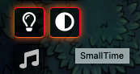
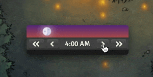
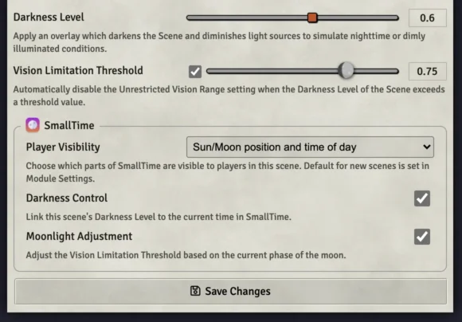
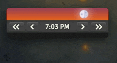
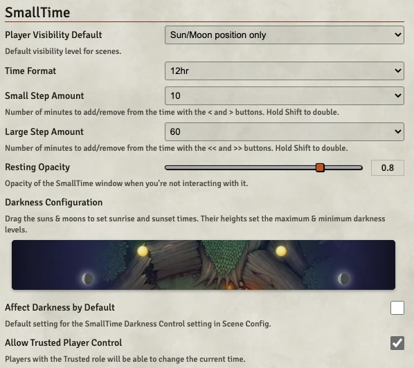

# SmallTime

_A small module for displaying and controlling the current time of day._

## Quick Summary

- Drag the sun/moon or click the forward/back buttons to change the time.
- Shift-click the buttons to double the amount.
- Bottom of the window is a repositioning drag handle.
- Button steps and various other things are changeable in Module Settings.
- Shift-click the moon to cycle the moon's phase. If you're running Simple Calendar, your phase will be synced from there.
- Toggle show/hide button is in Journal Notes.
- Darkness link toggle and Player visibility controls are in Scene Config.
- With a calendar-providing module enabled, click the time to display the date.
- If a module or game system provides a realtime clock, Shift-click the time to toggle it.

Video overview: (somewhat out of date now, but it covers the main bits :) [https://www.youtube.com/watch?v=XShiobMvatE](https://www.youtube.com/watch?v=XShiobMvatE)

### How to Use

There's a show/hide toggle in the Journal Notes tool layer:

Use the forward/back buttons to change the time, or drag the sun/moon icon (non-GM users will not have these controls):

You can position the window anywhere you like with the drag handle at the bottom, or pin it just above the Players list:

For each scene, you can choose how much of the display can be seen by Players, and whether or not to link the time to the scene's Darkness Level:

If you have a calendar-providing module (or game system) enabled, SmallTime will sync with its date. Clicking on the time will toggle the date display; Shift-clicking the time will toggle the realtime clock (if provided by your other modules or game system).

If you have [Simple Calendar](https://foundryvtt.com/packages/foundryvtt-simple-calendar) enabled, make sure its sync setting is on "Mixed", and also click its "Export to About Time" button to start the sync. Calendar and time info from there should now sync up with SmallTime, though I don't currently support nonstandard time divisions.

### Settings

There are a number of settings you can change:

...including custom sunrise/sunset times, and global maximum & minimum darkness levels:

### Languages

Full support for:

- English
- Japanese (thanks @BrotherSharp!)
- German (thanks @kdomke!)
- Spanish (thanks @masr!)
- Korean (thanks @jbblily!)

I'm happy to accept and implement more translations!

### Need Help?

If something's not working right, or you've got other questions or comments, feel free to hit me up on the [Discord](https://discord.gg/DeCbb8xbUw) (@unsoluble#5084), or file a [ticket](https://github.com/unsoluble/smalltime/issues).
