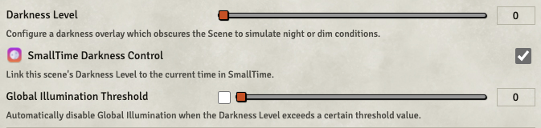
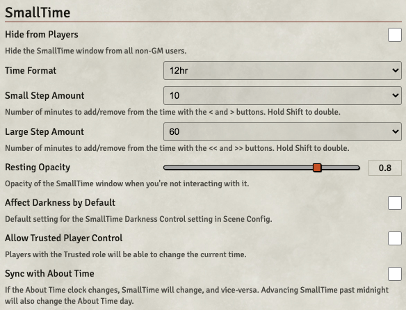

# SmallTime

*A small module for displaying and controlling the current time of day.*

## Quick Summary

* Drag the sun/moon or click the forward/back buttons to change the time.
* Shift-click the buttons to double the amount.
* Bottom of the window is a repositioning drag handle.
* Button steps and various other things are changeable in Module Settings.
* Shift-click the moon to cycle the moon's phase. If you're running Simple Calendar, your phase will be synced from there.
* Toggle show/hide button is in Lighting Controls.
* Darkness link toggle is in Scene Config.
* With About Time sync enabled, click the time to display the date; Shift-click the time to toggle the realtime clock.

Video overview: [https://www.youtube.com/watch?v=XShiobMvatE](https://www.youtube.com/watch?v=XShiobMvatE)

### How to Use

There's a show/hide toggle in the Lighting Controls tool layer:

Use the forward/back buttons to change the time, or drag the sun/moon icon (non-GM users will not have these controls):

You can position the window anywhere you like with the drag handle at the bottom, or pin it just above the Players list:

For each scene, you can choose whether or not to link the time to the scene's Darkness Level:

If you have [About Time](https://foundryvtt.com/packages/about-time) enabled, you can choose to sync with its time and date. Clicking on the time will toggle the date display; Shift-clicking the time will toggle the realtime clock (as configured in About Time).

### Settings

There are a number of settings you can change:

### Languages

The settings text is only in English currently, but I'm happy to accept and implement translations.

### Need Help?

If something's not working right, or you've got other questions or comments, feel free to hit me up on the [Discord](https://discord.gg/DeCbb8xbUw) (@unsoluble#5084), or file a [ticket](https://github.com/unsoluble/smalltime/issues).
