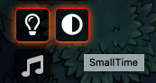
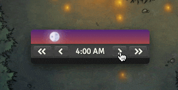
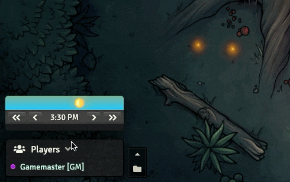
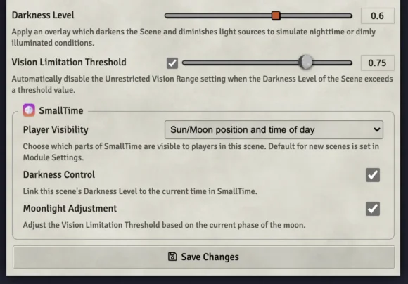
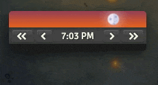
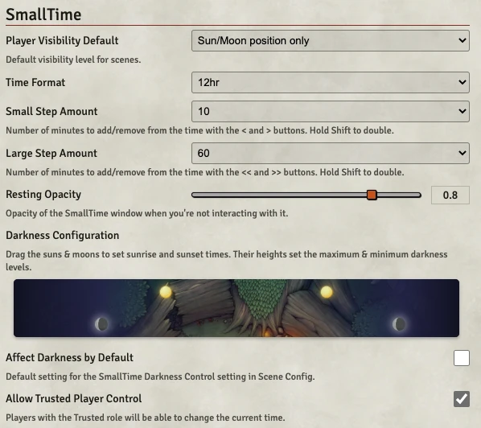

# SmallTime

_A small module for displaying and controlling the current time of day._

## Quick Summary

- Drag the sun/moon or click the forward/back buttons to change the time.
- Shift-click the buttons to double the amount. Alt for half.
- Bottom of the window is a repositioning drag handle.
- Button steps and various other things are changeable in the settings.
- Shift-click the moon to cycle the moon's phase (if it's not already being synced from a calendar source).
- Toggle show/hide button is in the Journal Notes tool group.
- Darkness link toggle and Player visibility controls are in Scene Config.
- Date display uses the core Foundry calendar API (and will pick up calendar data automatically from your game system or module calendar).
- Click the time to hide/show the date.
- Click the date to open an available calendar UI (Calendaria or PF2e World Clock).
- Shift-click the time to toggle the realtime clock, if provided and enabled by a module.

Video overview: (somewhat out of date now, but it covers the main bits :) [https://www.youtube.com/watch?v=XShiobMvatE](https://www.youtube.com/watch?v=XShiobMvatE)

### How to Use

There's a show/hide toggle in the Journal Notes tool group:

Use the forward/back buttons to change the time, or drag the sun/moon icon (non-GM users will not have these controls):

You can position the window anywhere you like with the drag handle at the bottom, or pin it just above the Players list:

For each scene, you can choose how much of the display can be seen by Players, and whether or not to link the time to the scene's Darkness Level:

SmallTime uses Foundry's core calendar API for date display, and can pick up additional date/time/calendar data supplied by game systems or modules. Clicking the time toggles the date tray. Clicking the date opens the most relevant available calendar UI (for example, Calendaria's calendar view, or PF2e's World Clock).

If a game system or module provides sunrise/sunset values through the core calendar ecosystem, SmallTime can sync to those values (with a setting to disable syncing and use manual rise/set positions instead). While synced, the rise/set controls remain available for darkness shape tuning (vertical movement), but their time positions are locked to the provider.

### Settings

There are a number of settings you can change:

...including custom sunrise/sunset times, and global maximum & minimum darkness levels:

### Languages

Full support for:

- English
- Japanese (thanks @BrotherSharp!)
- German (thanks @kdomke!)
- Spanish (thanks @masr!)
- Korean (thanks @jbblily!)
- French (thanks @DarKDinDoN!)
- Portuguese (Brazil) (thanks @Castanho!)
- Simplified Chinese
- Traditional Chinese
- Italian
- Polish
- Czech

I'm happy to accept and implement more translations!

### Need Help?

If something's not working right, or you've got other questions or comments, feel free to hit me up on the [Discord](https://discord.gg/foundryvtt) (@unsoluble#5084), or file a [ticket](https://github.com/unsoluble/smalltime/issues).
